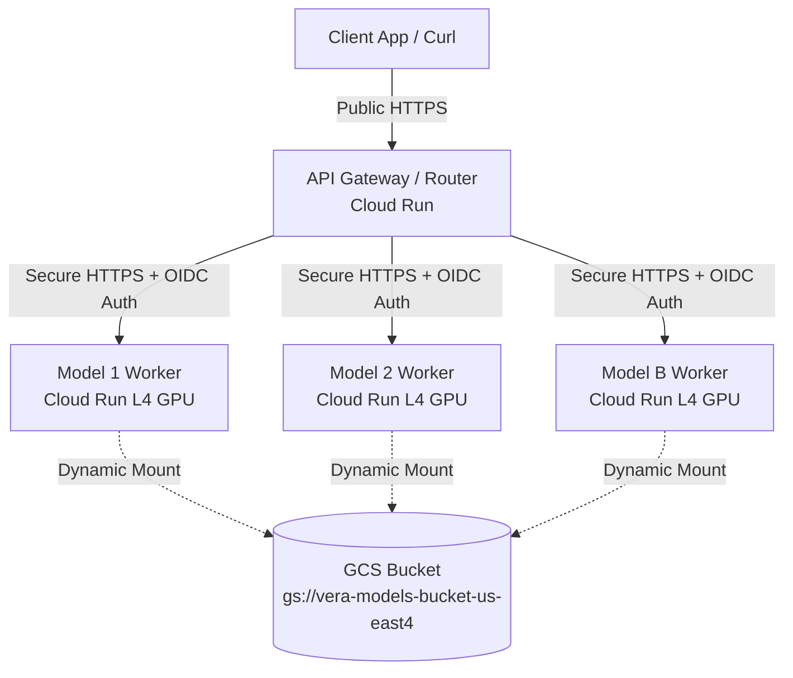

# Vera Whisper Backend: Serverless GPU Microservices on Cloud Run

A highly performant, secure, and backwards-compatible audio transcription backend designed for the Vera ecosystem. This architecture decomposes a legacy monolithic server into dynamic, isolated, serverless GPU microservices on Google Cloud Run.

---

## 🏗️ Architecture Overview



---

## ⚡ Key Highlights & Features

1. **Dynamic Model Selection:** Clients select which specialized Whisper model to run dynamically via the URL query parameters (e.g. `?model=model-1`).
2. **Cost-Efficient Serverless Scaling:** All model worker services run on powerful **NVIDIA L4 GPUs** with CPU/Int8 fallbacks, scaling down to `0` instances when inactive to completely avoid idle GPU costs.
3. **No Massive Image Uploads:** Whisper model directories (totaling 4.5 GB) are stored once in Google Cloud Storage and dynamically mounted to the worker instances at startup using **Cloud Run GCSFuse volume mounts**, ensuring sub-minute container builds.
4. **Automated OIDC Authorization:** Downstream workers remain entirely private (`--no-allow-unauthenticated`) to prevent public exploitation. The gateway dynamically requests a cryptographically-signed **Google OIDC ID Token** from the GCP Metadata Server to authorize private inter-service calls securely.
5. **Backwards Compatible:** Supports both `file` and `wav` form-upload parameters and returns both `"transcript"` and `"transcription"` JSON keys, ensuring out-of-the-box operation with your Flutter client app.

---

## 📁 Repository Structure

```text
vera-backend/
├── gateway/                 # Lightweight FastAPI Router (routes & authorizes traffic)
│   ├── main.py
│   └── requirements.txt
├── model_service/           # Parametric worker script preloading target Whisper models
│   ├── main.py
│   └── requirements.txt
├── Dockerfile.gateway       # Dockerfile for the slim API Gateway
├── Dockerfile.model         # GPU-enabled PyTorch/faster-whisper Dockerfile
├── docker-compose.yml       # Local multi-service orchestration (GPU enabled)
├── GCP_DEPLOYMENT.md        # Comprehensive Google Cloud deployment instructions
└── README.md                # This premium documentation
```

---

## 💻 Local Development & Orchestration

To run the entire suite locally with full GPU acceleration, Docker Compose mounts your local model folders directly:

```bash
# Start all 4 containers in the background
docker compose up --build -d

# Follow real-time logs across all services
docker compose logs -f
```

---